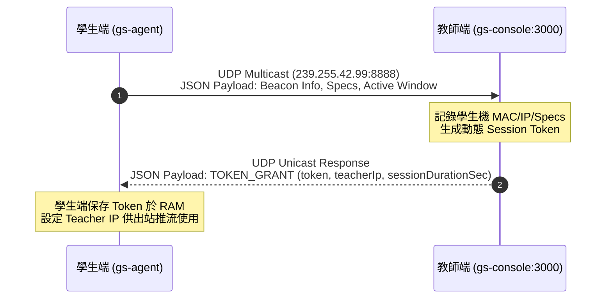
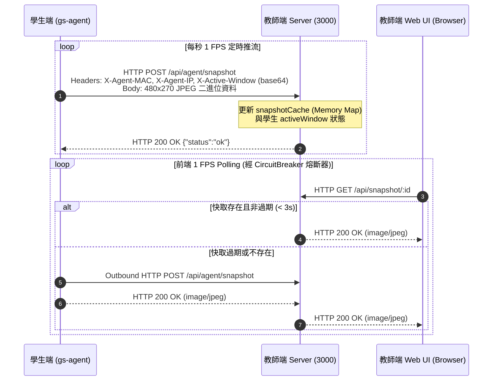
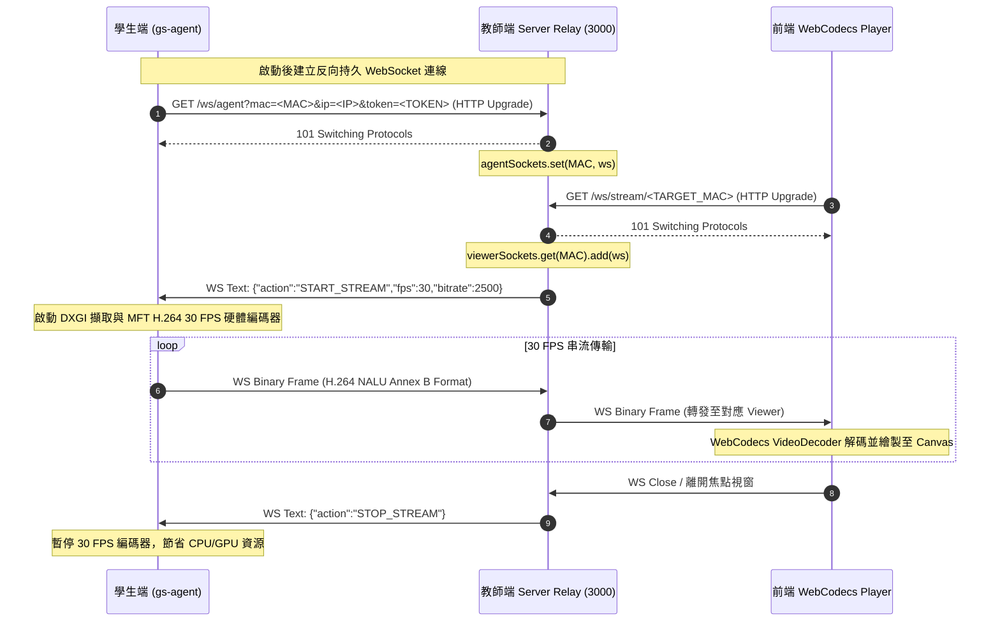
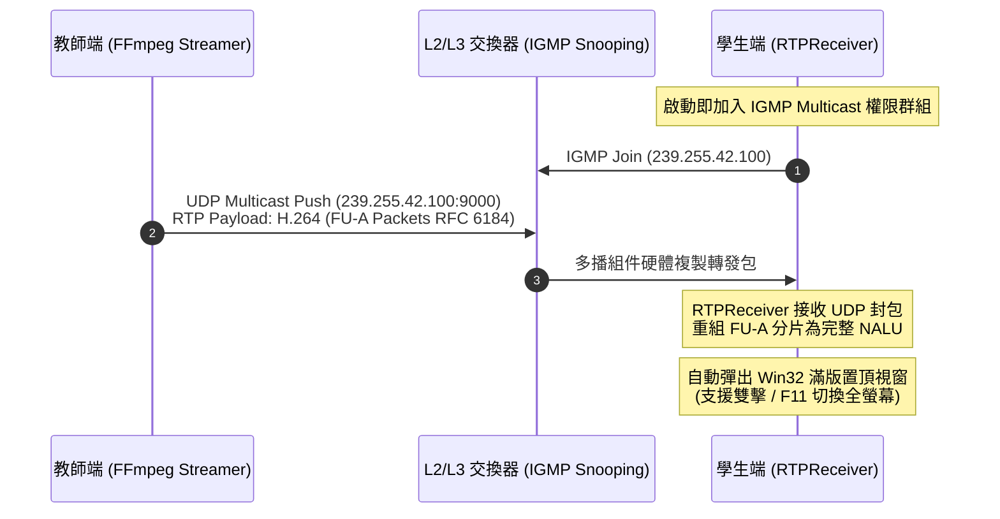

# GridSight 通訊協定與網路架構規範 (Protocol Specification)

本文檔完整且精確地定義 GridSight Console (教師端控制台) 與 GridSight Beacon (`gs-agent.exe` 學生端代理程式) 之間的所有通訊協定規範、網路傳輸方向、連接埠矩陣、訊息格式與系統限制。

---

## 📌 1. 網路協定與連接埠矩陣 (Protocol & Port Matrix)

| 協定 / 服務 | 連接埠 / 多播位址 | 發起方 (Initiator) | 接收方 (Listener) | 連線方向 | 目的與說明 | 防火牆與網路配置要求 |
| :--- | :--- | :--- | :--- | :--- | :--- | :--- |
| **UDP Multicast Beacon** | `239.255.42.99:8888` | 學生端 (Agent) | 教師端 (Console) | 學生 ➔ 教師 (Multicast) | 學生端啟動時廣播心跳、硬體資訊及焦點視窗標題 | 需允許 UDP 239.255.42.99 入站/出站及網卡多播轉發 |
| **UDP Unicast Token Grant** | 動態 UDP 連接埠 (回傳 Port) | 教師端 (Console) | 學生端 (Agent) | 教師 ➔ 學生 (Unicast Response) | 教師端授予學生端 Session Token 與 Teacher IP | 需允許 UDP 單播回應 |
| **HTTP Snapshot Push** | `TCP 3000` (`POST /api/agent/snapshot`) | 學生端 (Agent) | 教師端 (Console) | 學生 ➔ 教師 (Outbound HTTP) | 學生端每秒主動推送 480×270 JPEG 縮圖至教師端快取 | 學生端出站 TCP 3000，無需開啟學生端入站防護 |
| **HTTP Snapshot Fetch** | `TCP 3000` (`GET /api/snapshot/:id`) | 前端瀏覽器 | 教師端 (Console) | 瀏覽器 ➔ 教師 (HTTP GET) | 前端監控面板向教師端後端讀取快取之最新學生縮圖 | 教師端 TCP 3000 入站允許 |
| **Reverse WebSocket Relay** | `TCP 3000` (`/ws/agent?mac=...&ip=...&token=...`) | 學生端 (Agent) | 教師端 (Console) | 學生 ➔ 教師 (Outbound WS) | 學生端主動向教師端建立反向持久 WS 連線，接收控制指令與傳輸 H.264 串流 | 學生端出站 TCP 3000，可穿越一般客戶端防火牆 |
| **Teacher Viewer WS** | `TCP 3000` (`/ws/stream/:target`) | 前端瀏覽器 | 教師端 (Console) | 瀏覽器 ➔ 教師 (WS GET) | 前端 30 FPS 焦點調閱播放器連接教師端中繼以接收 H.264 串流 | 教師端 TCP 3000 入站允許 |
| **Reverse WebSocket Relay** | `TCP 3000` (`/ws/agent`) | 學生端 (Agent) | 教師端 (Server) | 學生 ➔ 教師 (Outbound WS) | 學生端向教師端建立長連線，用於 30 FPS 焦點畫面與指令中繼 | 無需開啟學生端入站防火牆 |
| **RTP Multicast Broadcast** | `239.255.42.100:9000` | 教師端 (FFmpeg/Console) | 學生端 (Agent) | 教師 ➔ 學生 (UDP Multicast) | 教師畫面 H.264 廣播串流，支援三檔品質（高 1080p30/8M、中 720p30/4M、低 480p15/1.5M） | 交換器需開啟 IGMP Snooping 轉發多播封包 |

---

## 📊 2. 系統架構與通訊流程圖 (Mermaid Diagrams)

### 2.1 設備探索與動態 Token 鑑權流程 (Discovery & Token Grant)



### 2.2 常態監控縮圖推拉流程 (Snapshot Push, Cache & Fetch)



### 2.3 焦點 30 FPS 實時串流雙向中繼流程 (Focus Streaming Flow)



### 2.4 教師全體廣播串流流程 (Classroom Broadcast Flow)



---

## 📄 3. 詳細 API 規格與資料格式 (Endpoints & Payloads)

### 3.1 學生端宣告 (Beacon Announcement)
- **傳輸方式**：UDP Multicast (`239.255.42.99:8888`，可經 `MULTICAST_IP` / `MULTICAST_PORT` 環境變數覆寫)
- **發送頻率**：啟動時發送，隨後 3~5 秒隨機抖動週期發送。
- **Payload 格式 (JSON)**：
```json
{
  "type": "BEACON",
  "version": "5.8.8",
  "hostname": "PC-01",
  "ip": "192.168.1.101",
  "mac": "00:1A:2B:3C:4D:01",
  "username": "Student01",
  "timestamp": 1723812345678,
  "active_window": "Visual Studio Code - main.cpp",
  "specs": {
    "agent_version": "5.8.8",
    "os": "Windows 11 Pro 64-bit",
    "uptime": 3600,
    "cpu": {
      "model": "12th Gen Intel(R) Core(TM) i7-12700",
      "cores": 12,
      "usage_percent": 15.5
    },
    "ram": {
      "total_mb": 16384,
      "avail_mb": 8192,
      "usage_percent": 50.0
    },
    "disk": {
      "drive": "C:\\",
      "total_gb": 512,
      "free_gb": 256,
      "usage_percent": 50.0
    }
  }
}
```

### 3.2 Token 授權回應 (Token Grant)
- **傳輸方式**：UDP Unicast (回應至學生發送端點)
- **Payload 格式 (JSON)**：
```json
{
  "type": "TOKEN_GRANT",
  "token": "d8a1f8c4e2b094817a3f89e210cd4e5f",
  "teacherIp": "192.168.1.200",
  "sessionDurationSec": 10800
}
```

### 3.3 學生端推送縮圖 (`POST /api/agent/snapshot`)
- **目標端點**：`http://<TEACHER_IP>:3000/api/agent/snapshot`
- **Headers**：
  - `X-Agent-MAC`: `00:1A:2B:3C:4D:01`
  - `X-Agent-IP`: `192.168.1.101`
  - `X-Active-Window`: Base64 編碼之當前視窗標題（例如：`VmlzdWFsIFN0dWRpbyBDb2Rl`）
  - `Content-Type`: `image/jpeg`
- **Body**：480×270 JPEG 影像二進位數據 (Quality 70)
- **回應**：`200 OK` `{"status":"ok"}`

### 3.4 前端讀取快取縮圖 (`GET /api/snapshot/:id`)
- **請求端點**：`http://<TEACHER_IP>:3000/api/snapshot/00:1A:2B:3C:4D:01` 或 `/api/snapshot/192.168.1.101`
- **回應標頭**：
  - `Content-Type`: `image/jpeg`
  - `Cache-Control`: `no-cache, no-store, must-revalidate`
- **錯誤處理**：若記憶體無快取且嘗試 Agent Proxy 也失敗，回傳 `404 Not Found` `{"error":"No snapshot available"}`

### 3.5 學生端反向 WebSocket (`/ws/agent`)
- **端點**：`ws://<TEACHER_IP>:3000/ws/agent?mac=<MAC>&ip=<IP>&token=<TOKEN>`（Upgrade 時驗證 MAC+token；教師端 viewer 端點 `/ws/stream/<TARGET_MAC>` 則驗教師 session token）
- **方向**：學生端 ➔ 教師端 (Outbound WS)
- **訊息類型**：
  - **二進位訊息 (Binary)**：H.264 NAL Unit (帶 `0x00000001` 起始碼之 Annex B 格式)。
  - **控制控制指令 (Text JSON From Teacher)**：
    - `{"action": "START_STREAM", "fps": 30, "bitrate": 2500}`
    - `{"action": "STOP_STREAM"}`
    - `{"action": "OPEN_URL", "url": "https://example.com"}`
    - `{"action": "SHARE_FILE", "url": "http://<TEACHER_IP>:3000/api/share/download/<fileId>/<filename>", "filename": "lesson1.pdf", "fileSize": 1048576}`
    - `{"action": "SHUTDOWN", "timeout": 30}`：通知學生端開啟 30 秒置頂倒數視窗並執行關機。
    - `{"action": "CANCEL_SHUTDOWN"}`：通知學生端即刻銷毀倒數視窗並中止關機流程。
      - `url`：教師端檔案下載端點（學生端以此發起 HTTP GET 下載，無需鑑權）。
      - `filename`：伺服器端已消毒之檔名（`path.basename` + 非法字元取代為 `_`），學生端存檔時據此避免目錄攻擊。
      - `fileSize`：檔案大小（位元組），供學生端校驗下載完整性（目前學生端實作尚未消費此欄位，僅供保留/未來驗證用）。

### 3.6 學生端出站推播與反向 WebSocket (零入站開埠)
- **`GET /snapshot`**：
  - 支持 Query 參數 `full=1` 或 `highres=1`。若指定高解析度，則即時擷取 1:1 螢幕解析度並編碼 JPEG (Quality 85) 回傳；否則回傳本地快取之 480×270 縮圖。
  - 支持 `X-Auth-Token` Header 鑑權。
- **`GET /status`**：
  - 回傳學生端硬體遙測數據 (JSON 格式)，並包含各元件 named-heartbeat 年齡（`capture-worker`、`snapshot-encode`、`ws-connected` 等）與 `capture_degraded` 旗標，供教師端 `/api/health` 與 watchdog 判讀元件級健康狀態。
- **`GET /ping`**：
  - 回傳 `{"status":"ok","service":"GridSight Beacon"}` 用於探針檢測。

### 3.7 教師端廣播控制 API (Broadcast Control)
- **`POST /api/broadcast/start`**（教師 session token）：啟動教師畫面全體廣播。Body（可選 `quality` 三檔預設，或直接指定）：
```json
{ "quality": "medium" }
```
  - `quality`：`"high" | "medium" | "low"`。對應預設：
    - `high`: 1080p (縮放關閉) · 30 FPS · 8 Mbps
    - `medium`（預設）: 720p · 30 FPS · 4 Mbps
    - `low`: 480p · 15 FPS · 1.5 Mbps
  - 亦可改以 `{ "fps": ..., "bitrateKbps": ..., "scale": ... }` 細部覆寫（`scale` 為輸出最大高度，0=不縮放）。
- **`POST /api/broadcast/stop`**：停止廣播。
- **`GET /api/broadcast/status`**：回傳 `{ active, mode, quality, bitrateKbps }`，`bitrateKbps` 為當前實際廣播推流碼率。
- **`POST /api/broadcast/test/start`**（媒體測試）與 **`/api/broadcast/test/stop`**：以本機檔案或網址透過同一 RTP 多播群組推流測試。`test/start` 亦支援 `quality` 或 `fps`/`bitrateKbps`/`scale`。

### 3.8 電源管理 API (Power Management)
- **`POST /api/power/shutdown`**：發送關機指令給指定機台或全班。Body: `{"targets": ["ALL"], "timeout": 30}`。
- **`POST /api/power/cancel-shutdown`**：發送撤銷關機指令給指定機台或全班。Body: `{"targets": ["ALL"]}`。

---

## ⚠️ 4. 實作狀態與注意事項 (Implementation Notes & Caveats)

**RTP 廣播渲染管線 (RTPReceiver Frame Rendering)**：
   - 已完整實作 **UDP Socket 監聽**、**IGMP 權限加入 (`IP_ADD_MEMBERSHIP)`、**RTP Header 解析**、**RFC 6184 FU-A / STAP-A 重組**（以 marker 位元組裝 Access Unit 後整幀解碼）、**SSRC 鎖定與逾時重新鎖定**（串流更換 SSRC 時執行完整狀態 reset）及 **Win32 滿版 overlay 彈窗 + Media Foundation MFT H.264 解碼渲染**。
   - 序號中斷或 FU-A 不完整時丟棄該幀，等待下一個 IDR 自動恢復。

2. **多網卡宣告與環境適應**：
   - 學生端預設以主要網卡 `Utils::GetSystemNetworkInfo()` 回傳 IP 進行廣播。若學生機具備虛擬網卡 (如 Docker, VMware)，需確保優先選用真實物理 LAN 網卡。

3. **全出站通訊（無入站埠）**：
   - v5.8.0 起已移除學生端傳統入站埠 `8080 / 8081`。焦點串流一律使用學生端出站反向 WebSocket `/ws/agent`，學生端零入站開埠，無需任何防火牆入站放行。
