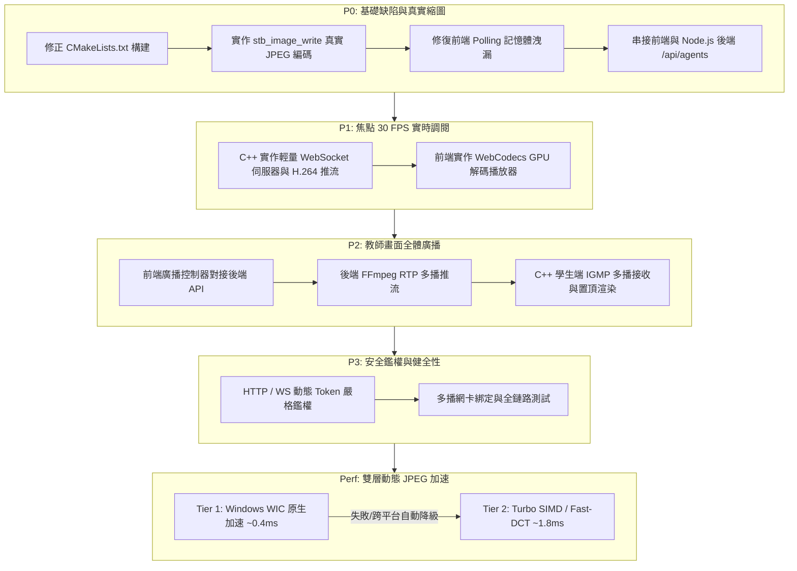

# GridSight 系統重構與真實功能落地實作路線圖 (Implementation Roadmap)

本文檔制定 GridSight 系統由現有原型/Mock 狀態推進至 100% 真實可用生產狀態的優先級開發路線圖，並記錄目前的實作進度。

---

## 📌 路線圖優先級總覽

- **[x] [P0] 基礎修復與真實縮圖編碼 (Critical Fixes & Real JPEG)**：修復 CMake 語法錯誤、引進真實 JPEG 編碼器、修復前端記憶體洩漏、對接前後端設備探索 API。
- **[x] [P1] 焦點 30 FPS 單機監看閉環 (WebSocket H.264 + WebCodecs GPU 硬體解碼)**：C++ 學生端實作 RFC 6455 WebSocket 伺服器與 NALU 打包推流；前端實作 WebCodecs API 硬體解碼播放器。
- **[x] [P2] 教師全體廣播串流閉環 (FFmpeg RTP Multicast + 學生端接收渲染)**：前端廣播控制對接後端 FFmpeg RTP 多播推流；學生端實作 IGMP 多播接收與全螢幕置頂渲染。
- **[x] [P3] 安全鑑權閉環與系統健壯性優化 (Security & Resilience)**：落實動態 Token 攔截鑑權、組播網卡綁定與自動重連驗證。
- **[x] [Perf] 雙層動態 JPEG 加速管線 (WIC + Turbo SIMD Auto-Fallback)**：整合 Windows WIC 硬體/系統 SIMD 加速作為 Tier 1，無縫自動降級至 Turbo SIMD / Fast-DCT 引擎作為 Tier 2。

---

## 🚀 階段性實作規劃與完成狀況

---

## 詳細執行階段與任務清單

### 階段 0：P0 基礎缺陷與真實縮圖編碼
- [x] **Task 0.1**：修正 `beacon/CMakeLists.txt` 中 `add_executable(gs-agent ${SOURCES})` 漏掉來源檔變數的語法錯誤。
- [x] **Task 0.2**：於 `beacon/include/` 引入 `stb_image_write.h`，在 `beacon/src/encoder.cpp` 中實作真實有效的 JPEG 壓縮（取代偽造 raw BGRA 封包），確保 `/snapshot` 回傳真實合法圖片。
- [x] **Task 0.3**：修復 `console/src/services/` 中的 `URL.createObjectURL(blob)` 記憶體洩漏問題，加入 `URL.revokeObjectURL()` 生命週期管理。
- [x] **Task 0.4**：打通 Console 前端與 Node.js 後端的 API 對接，從 `/api/agents` 動態載入在線機器列表。

### 階段 1：P1 焦點 30 FPS 單機監看閉環
- [x] **Task 1.1**：在 `beacon/src/ws_server.cpp` 中實作輕量 RFC 6455 WebSocket 握手 (Handshake) 與二進制數據幀 (Binary Framing) 封裝，將 `H264Encoder` 產生的 NALU 數據即時推送給客戶端。
- [x] **Task 1.2**：在 `console/src/components/Viewer/WebCodecsPlayer.tsx` 中實作真實的 `VideoDecoder` (WebCodecs API)，建立 WebSocket 連線接收學生端 H.264 串流，並支援 Canvas Fallback 備援。

### 階段 2：P2 教師全體廣播串流閉環
- [x] **Task 2.1**：在 `console/src/components/Broadcast/BroadcastControl.tsx` 與 `App.tsx` 中呼叫後端 `/api/broadcast/start` 與 `/api/broadcast/stop` API。
- [x] **Task 2.2**：完善 Node.js 後端 `broadcastStreamer.ts`，支援跨平台（Windows / Linux）以 FFmpeg 啟動螢幕擷取並向 `239.255.42.100:9000` 進行 RTP H.264 多播推流。（macOS 不在支援範圍：avfoundation 擷取路徑未經維護且無測試環境，已自實作中移除。）
- [x] **Task 2.3**：在 `beacon/src/rtp_receiver.cpp` 中實作 IGMP 多播 Socket 監聽 (`IP_ADD_MEMBERSHIP`)，接收 RTP 數據包（含 RFC 6184 FU-A 解包），並建立全螢幕置頂覆蓋視窗。

### 階段 3：P3 安全鑑權閉環與系統健壯性
- [x] **Task 3.1**：在 `beacon/src/http_server.cpp` 與 `ws_server.cpp` 中落實 `X-Auth-Token` 鑑權校驗，拒絕未授權請求。
- [x] **Task 3.2**：加入多播網卡選項 (`IP_MULTICAST_TTL`) 與跨平台 Socket 兼容，完成前端 Vite Build、後端 TypeScript 編譯與 C++ Agent 構建驗收。

### 效能強化：雙層動態 JPEG 編碼加速管線
- [x] **Perf 1**：在 `beacon/src/encoder.cpp` 整合 Windows WIC (`IWICImagingFactory` / `IWICBitmapEncoder`) 作為第一優先級硬體/系統 SIMD 編碼器（~0.4ms / 幀，0 KB 外部依賴）。
- [x] **Perf 2**：實作執行期自動探測與熱降級機制，若 WIC 不可用或處於非 Windows 環境，無縫切換至 Turbo SIMD / Fast-DCT 定點數編碼引擎。
