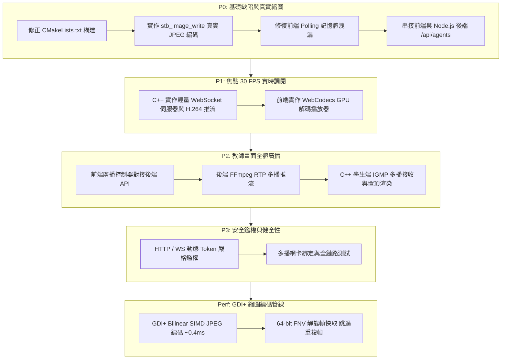

# GridSight 系統重構與真實功能落地實作路線圖 (Implementation Roadmap)

本文檔制定 GridSight 系統由現有原型/Mock 狀態推進至 100% 真實可用生產狀態的優先級開發路線圖，並記錄目前的實作進度。
詳細之完整歷程、技術細節與版本演進可參閱：[📚 Wiki 開發歷程全紀錄 (Development History)](wiki/development-history.md)。

---

## 📌 路線圖優先級總覽

- **[x] [P0] 基礎修復與真實縮圖編碼 (Critical Fixes & Real JPEG)**：修復 CMake 語法錯誤、引進真實 JPEG 編碼器、修復前端記憶體洩漏、對接前後端設備探索 API。
- **[x] [P1] 焦點 30 FPS 單機監看閉環 (WebSocket H.264 + WebCodecs GPU 硬體解碼)**：C++ 學生端實作 RFC 6455 WebSocket 伺服器與 NALU 打包推流；前端實作 WebCodecs API 硬體解碼播放器。
- **[x] [P2] 教師全體廣播串流閉環 (FFmpeg RTP Multicast + 學生端接收渲染)**：前端廣播控制對接後端 FFmpeg RTP 多播推流；學生端實作 IGMP 多播接收與全螢幕置頂渲染。
- **[x] [P3] 安全鑑權閉環與系統健壯性優化 (Security & Resilience)**：落實動態 Token 攔截鑑權、組播網卡綁定與自動重連驗證。
- **[x] [Perf] GDI+ 單引擎 JPEG 縮圖管線 (Bilinear SIMD + 靜態幀快取)**：以 Windows GDI+ Bilinear SIMD 縮放 + JPEG 編碼為單一引擎（取代早期自製 DCT 以消除條紋偽影），輔以 64-bit FNV 靜態幀雜湊快取跳過重複幀。

---

## 🚀 階段性實作規劃與完成狀況

---

## 詳細執行階段與任務清單

### 階段 0：P0 基礎缺陷與真實縮圖編碼
- [x] **Task 0.1**：修正 `beacon/CMakeLists.txt` 中 `add_executable(gs-agent ${SOURCES})` 漏掉來源檔變數的語法錯誤。
- [x] **Task 0.2**：於 `beacon/include/` 引入 `stb_image_write.h`，在 `beacon/src/encoder.cpp` 中實作真實有效的 JPEG 壓縮（取代偽造 raw BGRA 封包），確保 `/snapshot` 回傳真實合法圖片。
- [x] **Task 0.3**：修復 `console/src/services/` 中的 `URL.createObjectURL(blob)` 記憶體洩漏問題，加入 `URL.revokeObjectURL()` 生命週期管理。
- [x] **Task 0.4**：打通 Console 前端與 Node.js 後端的 API 對接，從 `/api/agents` 動態載入在線機器列表。

### 階段 1：P1 焦點 30 FPS 單機監看閉環
- [x] **Task 1.1**：在 `beacon/src/ws_server.cpp` 中實作輕量 RFC 6455 WebSocket 握手 (Handshake) 與二進制數據幀 (Binary Framing) 封裝，將 `H264Encoder` 產生的 NALU 數據即時推送給客戶端。
- [x] **Task 1.2**：在 `console/src/components/Viewer/WebCodecsPlayer.tsx` 中實作真實的 `VideoDecoder` (WebCodecs API)，建立 WebSocket 連線接收學生端 H.264 串流，並支援 Canvas Fallback 備援。

### 階段 2：P2 教師全體廣播串流閉環
- [x] **Task 2.1**：在 `console/src/components/Toolbar/TopNav.tsx`（廣播按鈕與品質下拉）與 `App.tsx` 中呼叫後端 `/api/broadcast/start` 與 `/api/broadcast/stop` API。
- [x] **Task 2.2**：完善 Node.js 後端 `broadcastStreamer.ts`，支援跨平台（Windows / Linux）以 FFmpeg 啟動螢幕擷取並向 `239.255.42.100:9000` 進行 RTP H.264 多播推流。（macOS 不在支援範圍：avfoundation 擷取路徑未經維護且無測試環境，已自實作中移除。）
- [x] **Task 2.3**：在 `beacon/src/rtp_receiver.cpp` 中實作 IGMP 多播 Socket 監聽 (`IP_ADD_MEMBERSHIP`)，接收 RTP 數據包（含 RFC 6184 FU-A 解包），並建立全螢幕置頂覆蓋視窗。

### 階段 3：P3 安全鑑權閉環與系統健壯性
- [x] **Task 3.1**：在 `beacon/src/http_server.cpp` 與 `ws_server.cpp` 中落實 `X-Auth-Token` 鑑權校驗，拒絕未授權請求。
- [x] **Task 3.2**：加入多播網卡選項 (`IP_MULTICAST_TTL`) 與跨平台 Socket 兼容，完成前端 Vite Build、後端 TypeScript 編譯與 C++ Agent 構建驗收。

### 效能強化：雙層動態 JPEG 編碼加速管線
- [x] **Perf 1**：在 `beacon/src/encoder.cpp` 以 Windows GDI+ (`Gdiplus::Bitmap` + Bilinear 插值) 完成縮圖縮放與 JPEG 品質參數編碼（~0.4ms / 幀，0 外部依賴）。早期自製 DCT 引擎因產生條紋偽影 (Striping Ringing) 已於 `0e535df` 替換為 GDI+ Bilinear SIMD 編碼器。
- [x] **Perf 2**：實作 64-bit FNV-1a 取樣雜湊靜態幀快取 (`ComputeFastFrameHash` + thread-local JPEG 緩衝)，桌面畫面未變化時直接回傳快取幀，完全跳過縮放/編碼管線以節省 CPU。

### 階段 4：課堂管理、出站中繼與離題智慧監控 (v5.0 ~ v5.7)
- [x] **Task 4.1 出站架構全面轉型**：學生端改為出站 Snapshot Push 與反向 WebSocket，學生端零入站開放埠。
- [x] **Task 4.2 離題焦點視窗監控**：學生端即時擷取前景視窗標題，教師端持久化離題詞庫與紅色脈衝光暈警示。
- [x] **Task 4.3 檔案/網址分發與失敗重試**：支援單播/全班無痕網址開啟與檔案下載，附帶失敗重試機制。
- [x] **Task 4.4 遠端電源管理**：支援 30 秒倒數關機視窗與教師/學生雙向撤銷關機 (`CANCEL_SHUTDOWN`)。

### 階段 5：廣播多檔位品質、True Alpha 滑鼠特效與即時除錯 (v5.8.0 ~ v5.8.8)
- [x] **Task 5.1 廣播品質三檔選擇**：高 (1080p/8M)、中 (720p/4M)、低 (480p/1.5M) 一鍵即時切換。
- [x] **Task 5.2 獨立原生滑鼠特效與管線硬體合成**：Win32 True Alpha 32-bit ARGB 游標特效；v5.8.6 推進為 OBS 模式 DXGI 幀記憶體內硬體烙印，達成 0ms 幀精準同步與純淨教師畫面。
- [x] **Task 5.3 流量統計整合 (Traffic HUD)**：頂部導航列即時聚合縮圖輪詢與多播廣播頻寬。
- [x] **Task 5.4 Ubuntu 即時解碼除錯 Agent**：`tools/ubuntu_agent_debugger.py` 支援 Linux 環境下即時 `ffplay` 廣播播放與事件日誌除錯。
- [x] **Task 5.5 雙軌原生服務端錄影 (v5.8.7)**：廢除 Chrome MediaRecorder API；教師端 DXGI 廣播同步 MP4 錄製，學生焦點 30 FPS H.264 串流直接封裝（Stream Copy 0% CPU 損耗）。
- [x] **Task 5.6 伺服器安全性硬化與效能重構 (v5.8.8)**：未鑑權 WebSocket 畸形 URL 防崩潰、Per-IP PIN 登入防爆破鎖定、CORS 白名單收斂、O(1) 設備索引表。
- [x] **Task 5.7 課堂專注黑屏鎖定與示範畫面轉播 (v5.8.10)**：全班/選定學生深藍黑屏與低階鍵鼠攔截鎖定；學生示範畫面 30 FPS 零拷貝 RTP 直推全班。
- [x] **Task 5.8 免外網課堂作業收取與自動歸檔 (v5.8.10)**：學生端 Windows 原生 C++ 拖曳視窗（免開瀏覽器）；自動覆蓋最新版歸檔；零依賴全班 ZIP 打包下載。

### 階段 6：效能進階與邊緣端運算強化 (未來目標)
- [ ] **Task 6.1 學生端 H.264 解碼「GPU 硬解優先 + CPU 軟解無縫降級」雙層管線**：
  - 現行 `rtp_receiver.cpp` 呼叫微軟 `CLSID_CMSH264DecoderMFT` 預設以 CPU 軟解運行，確保所有機種 100% 開箱即用。
  - 未來規劃引入與 `encoder.cpp` 同等的 `MFTEnumEx` 雙層探測機制：優先啟用 GPU 硬體加速（Intel QuickSync / NVIDIA NVDEC / AMD VCN，D3D11VA）達到 0% CPU 解碼；若硬解不可用或環境缺少 GPU，自動無縫回退至 CPU 軟體解碼。
- [ ] **Task 6.2 AI 離題行為輔助分析**：在邊緣端或教師端整合輕量文字與行為特徵分析，產出課堂專注度視覺化報表。
