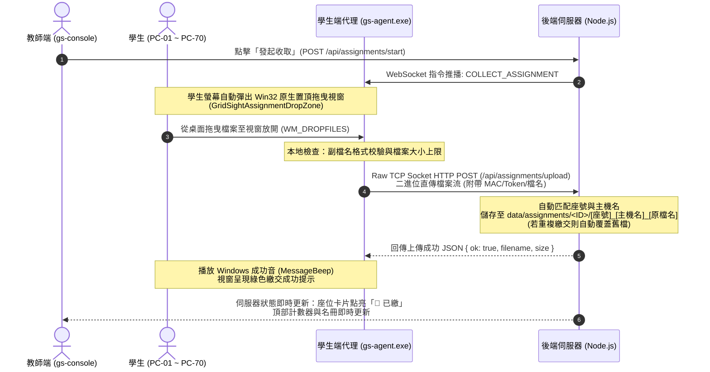

# 📁 課堂作業批次收取與自動歸檔指南 (Classroom Assignment Dropbox Guide)

本文件詳細說明 GridSight 在 70 台電腦教室環境下，免外網、免開啟瀏覽器、防抄襲且支援自動座號對齊的**「課堂作業批次收取與自動歸檔」**系統之架構設計與完整操作流程。

---

## 🎯 1. 核心設計理念與痛點解決

傳統電腦教室收取作業常面臨以下挑戰：
1. **依賴外網或雲端表單（Google Forms/網頁）**：學校對外頻寬易塞車，學生開瀏覽器登入帳號耗時且容易分心逛網頁。
2. **共用資料夾（網路芳鄰/Samba/FTP）安全漏洞**：學生可隨意瀏覽或複製其他同學檔案，抄襲與誤刪風險極高。
3. **檔名混亂難對齊**：學生繳交檔名千奇百怪（如 `hw.cpp`、`未命名.zip`），教師課後需手動比對座號、耗費大量時間整理。

**GridSight 解決方案**：
- **學生端 Windows 原生置頂拖曳視窗**：由 C++ `gs-agent.exe` 直接渲染，學生直接從桌面或檔案總管將檔案拖入視窗放開即可繳交，**100% 免開瀏覽器**。
- **自動座號與主機名對齊歸檔**：伺服器結合教室座位佈局，自動將檔名標準化為 `[座號]_[電腦名稱]_[原檔名]`。
- **重複上傳自動更新最新版**：學生若修改程式重新拖入，伺服器自動覆蓋舊檔並更新繳交時間與大小，教師永遠保留學生最新版本。
- **一鍵全班零依賴 ZIP 打包**：後端以純 Node.js 原生實作 Deflate 壓縮與 CRC32 封包，點擊按鈕直接輸出標準 ZIP 檔案，教師隨身碟一鍵帶走。

---

## 🔄 2. 學生端繳交作業完整流程



### 步驟 1：學生電腦自動彈出繳交視窗
當教師發起收取時，學生端螢幕中央會立即自動彈出置頂拖曳小視窗：

```
┌─────────────────────────────────────────────────────────┐
│ 📁 GridSight 作業繳交 - Lab-01 矩陣運算            [X] │
├─────────────────────────────────────────────────────────┤
│                                                         │
│   ┌ - - - - - - - - - - - - - - - - - - - - - - - - ┐   │
│   │                                                 │   │
│   │           📥 請將作業檔案拖曳至此處             │   │
│   │                                                 │   │
│   │   [ 限定格式: cpp, py, zip | 單檔上限: 50MB ]   │   │
│   │                                                 │   │
│   └ - - - - - - - - - - - - - - - - - - - - - - - - ┘   │
│                                                         │
│   狀態: 等待拖曳檔案...                                 │
└─────────────────────────────────────────────────────────┘
```
- **置頂不奪焦**：具備 `WS_EX_TOPMOST` 確保不被其他視窗遮蔽，且 `WS_EX_NOACTIVATE` 避免打斷學生打字焦點。
- **限制格式提示**：動態展示教師設定的限定副檔名（如 `cpp, py, zip`）與大小上限。

### 步驟 2：直接拖曳檔案繳交
1. 學生從桌面、檔案總管或編輯器（如 VS Code 檔案總管面板）**直接選取作業檔案拖入視窗中央放開**。
2. **Win32 底層訊息攔截**：視窗啟用 `DragAcceptFiles(hwnd, TRUE)`，攔截作業系統 `WM_DROPFILES` 訊息並取得檔案路徑。
3. **本地即時防呆校驗**：
   - **格式不符**：若教師限制 `.cpp`，學生誤拖入 `.exe` 或 `.docx`，拖曳框邊框與文字立即轉紅顯示 `❌ 格式不符 (僅限: cpp, py, zip)`，並發出警告提示音（`MB_ICONHAND`），防呆防錯。
   - **超出大小**：若檔案超過上限，提示 `❌ 檔案超出大小上限 (最大 50MB)`。

### 步驟 3：極速 Socket 二進位直傳
- 學生端 C++ 啟動獨立背景線程，建立直接通往教師端 Port 3000 的 Raw TCP Socket。
- 發送 HTTP POST `/api/assignments/upload` 請求標頭：
  - `X-Agent-MAC`：學生網卡 MAC 位址。
  - `X-Auth-Token`：動態 HMAC 鑑權 Token。
  - `X-Assignment-Id`：當前進行中作業唯一識別碼。
  - `X-Filename`：UTF-8 Base64 編碼檔名。
- 檔案資料直接以區塊（Chunk）寫入 Socket，百 KB 級程式碼上傳僅需 **0.05 秒**，數十 MB 專案壓縮檔亦在數秒內完成。

### 步驟 4：繳交成功回饋與覆蓋更新機制
- **視覺與聽覺反饋**：
  - 系統播放成功音效（`MB_ICONASTERISK`）。
  - 視窗中央顯示綠色訊息：
    ```
    ✅ 繳交成功！
    檔案: matrix.cpp (15.2 KB)
    提示: 重複拖曳將自動更新為最新版
    ```
- **重複繳交無縫更新**：
  - 學生拖入修正後的程式碼時，伺服器直接自動覆蓋舊檔並更新時間戳與檔案大小，避免產生 `matrix (1).cpp` 等冗餘檔案，保證教師收到的一律為最新版。

---

## 🖥️ 3. 教師端即時監控與管理功能

### 3.1 畫布座位卡片即時反饋
- **狀態徽章**：已繳交之學生卡片標頭即時顯示綠色 **`📁 已繳`** 徽章。
- **懸浮預覽 (Tooltip)**：滑鼠懸浮在卡片徽章上，可直接檢視該學生繳交的檔名與檔案大小（例：`已繳交: matrix.cpp (15 KB)`）。

### 3.2 頂部導航列動態狀態
- 收取進行中時，頂部導航列按鈕呈現綠色脈衝光暈並顯示即時已繳件數：**`📁 收取中 (46)`**。點擊隨時可打開管理視窗。

### 3.3 作業管理視窗 (Assignment Modal)
- **進度指示概況**：顯示繳交進度條（`46 / 70 台 (65%)`）、發起時間與格式限制。
- **一鍵催繳 (Remind Unsubmitted)**：
  - 點擊 **【📢 一鍵催繳】**，後端自動過濾出「在線但尚未繳交」之學生機台，向其重新推播繳交提醒視窗，不干擾已繳交學生。
- **即時繳交名冊表**：
  - 列表依座號、主機名、繳交檔名、大小與時間精確呈現。
  - 支援「全部」與「已繳」一鍵篩選。
- **一鍵下載全班 ZIP 打包**：
  - 點擊 **【💾 下載全班作業打包 (ZIP)】**，伺服器純原生串流產生壓縮檔（`GridSight_作業_[名稱].zip`）。

---

## 🗄️ 4. 伺服器端目錄歸檔與打包技術

### 4.1 標準化歸檔命名規範
伺服器端資料目錄結構如下：
```
data/assignments/
└── as-mtkz4226-6mpu/                  # 作業識別碼目錄
    ├── 01_PC-01_matrix.cpp            # [座號]_[電腦名稱]_[原檔名]
    ├── 02_PC-02_matrix.cpp
    ├── 03_PC-03_matrix.py
    └── 05_PC-05_matrix.zip
```
- **特殊字元消毒**：所有路徑、座號與主機名稱皆經過嚴格消毒（過濾 `/ \ ? % * : | " < >`），防範路徑遍歷與目錄注入攻擊。
- **座號自動對齊**：依據教師端當前矩陣配置（`cachedLayout.seats`），若機台尚未排座則以 `未排座_[主機名]_[原檔名]` 備援標記。

### 4.2 零外部依賴純 Node.js ZIP 打包器 (`zipPacker.ts`)
為保證 Windows 單檔獨立執行檔（`gs-console.exe`）與綠色便攜包具備 100% 隨身攜帶特性，系統未引入任何第三方 npm 壓縮庫（如 archiver 或 adm-zip），純原生實作標準 ZIP 規格：
- **Deflate 壓縮**：呼叫 Node.js 內建 `node:zlib` 的 `deflateRawSync` 進行高效率壓縮。
- **CRC32 校驗**：使用預先計算的 256 項多項式查表法（Polynomial `0xEDB88320`），極速計算校驗碼。
- **標準 ZIP 標頭與目錄結構**：
  - Local File Header (`0x04034b50`)
  - Central Directory (`0x02014b50`)
  - End of Central Directory Record (`0x06054b50`)
  - 啟用 General Purpose Bit 11（UTF-8 檔名旗標），支援中文字元檔名完全不亂碼。
- **HTTP 串流下載**：配合 RFC 5987 / RFC 6266 `Content-Disposition: attachment; filename*=UTF-8''...` 標準標頭，各大現代瀏覽器皆可完美下載並保留中文檔名。

---

## ❓ 5. 常見問題與除錯手冊 (FAQ)

### Q1: 學生電腦如果沒看到彈出拖曳視窗怎麼辦？
1. 請確認該台學生電腦是否正常在線（畫布上座位顯示綠燈）。
2. 教師可直接點擊作業管理視窗內的 **【📢 一鍵催繳】**，系統會重新向所有尚未繳交之機台補發指令。
3. 或在畫布上直接選取該學生座位，使用底部操作列發起單機收取。

### Q2: 學生繳錯檔案如何重新繳交？
- **直接再次拖曳正確檔案即可**。
- 系統設計為「最新版覆蓋機制」，伺服器會自動以最新拖入的檔案覆蓋舊檔案，並在學生端顯示更新後的檔名與大小。

### Q3: 學生如果拖曳整個資料夾可以嗎？
- Windows 的 `WM_DROPFILES` 拖曳整個資料夾時為目錄句柄。若為多檔案或專案型作業，**建議學生將整個資料夾壓縮為 `.zip` 後拖入**。

### Q4: 學生繳交作業需要連外網嗎？
- **完全不需要**。作業上傳直接透過教室內部區域網路（Port 3000）以 TCP Socket 傳輸，即使教室完全斷開網際網路，依然能全速收取作業。
