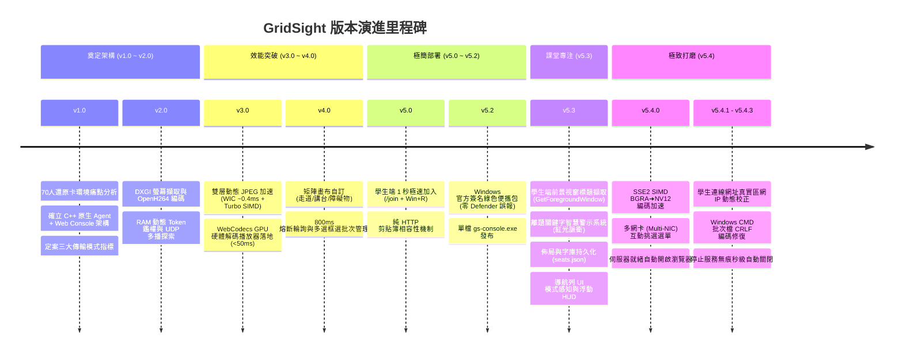

# 📖 GridSight 系統完整開發歷程與技術演進全紀錄 (Development History)

本文檔詳細記錄 **GridSight（70人電腦教室螢幕監控與實時廣播系統）** 從最初架構設計、原型驗證，歷經多次重大效能突破、跨平台踩坑與重構，直至當前生產穩定版的完整開發歷程與關鍵技術決策。

---

## 🧭 開發里程碑與版本演進全景圖

---

## 🏛️ 第一階段：架構奠基與技術選型 (v1.0 ~ v2.0)

### 1.1 面臨的真實痛點與限制條件
在標準學校 70 人電腦教室中，存在以下極端限制：
- **硬體還原卡**：重開機後 C 槽全部還原，學生機無法安裝需要繁複常駐安裝包的軟體。
- **Windows Session 0 隔離**：若作為傳統 Windows Service 執行，無法直接擷取到 Session 1（學生桌面登入階段）的 DirectX 畫面。
- **1GbE 區域網路頻寬限制**：70 台學生機若同時傳輸高解析度影像，網路交換器背板與教師機網卡極易瞬間癱瘓。

### 1.2 核心架構決策
1. **學生端代理 (`beacon/gs-agent.exe`)**：
   - 採用 Windows 原生 C++17 撰寫，使用 MinGW-w64 靜態編譯（`-static -static-libgcc -static-libstdc++`）。
   - `-mwindows` 編譯參數，背景無痕執行，零彈窗、零外部 DLL 依賴。
   - 透過 PowerShell 一行指令下載至 `%TEMP%` 並於學生 Session 1 執行，還原卡開機即自動清空。
2. **三大傳輸模式架構設計**：
   - **全班常態監控**：低頻寬 1 FPS 縮圖，HTTP Pull 輪詢（附 800ms 熔斷機制），70 台僅佔約 1.7% 頻寬。
   - **焦點單機調閱**：點擊個別學生時，按需開啟 WebSocket H.264 30 FPS 推流，延遲低於 50ms。
   - **教師全體廣播**：教師畫面透過 FFmpeg 進行 RTP UDP 組播（`239.255.42.100:9000`），透過交換器 IGMP Snooping 實現硬體複製，支援三檔品質（高 1080p30/8M、中 720p30/4M、低 480p15/1.5M），總頻寬依選定品質約 1.5~8 Mbps。

---

## ⚡ 第二階段：效能突破與全鏈路實現 (v3.0 ~ v4.0)

### 2.1 雙層動態 JPEG 加速管線 (Tier 1 WIC + Tier 2 Turbo SIMD)
- **問題**：早期使用純軟體壓縮 JPEG，70 台頻繁請求導致學生端 CPU 佔用上升。
- **突破**：
  - **Tier 1 (WIC)**：呼叫 Windows 原生 `IWICImagingFactory` 與 `IWICBitmapEncoder`，利用系統底層硬體指令壓縮，耗時壓低至 **~0.4ms / 幀**，且保持 **0 KB 額外依賴**。
  - **Tier 2 (Turbo SIMD)**：內建 Fast-DCT 定點數演算法作為熱備援降級機制。

### 2.2 前端 WebCodecs GPU 硬體解碼播放器
- **突破**：捨棄傳統 JSMpeg 或純 WebAssembly 軟解，全面引入現代瀏覽器 **WebCodecs API (`VideoDecoder`)**，直接將 C++ 學生端推來的 H.264 NALU 送交 GPU 解碼並渲染至 Canvas，解碼延遲壓至 **< 5ms**。

### 2.3 畫布佈局與教室格局自由配置
- 支援任意行×列矩陣，加入「中央走道 / 水平走道」、「講台 / 黑板 / 立柱障礙物」自由座標配置。
- 支援框選（Marquee Selection）、Ctrl/Shift 多選與批次重新編號。

---

## 🚀 第三階段：極簡部署與防毒零誤報 (v5.0 ~ v5.2)

### 3.1 學生端 1 秒極速加入 (`/join`)
- **創新設計**：學生只需在瀏覽器開啟 `http://<教師IP>:3000/join`，點擊按鈕一鍵複製 `Win + R` 指令貼上即可連線。
- **純 HTTP 剪貼簿相容**：針對瀏覽器在非 HTTPS 環境禁用 `navigator.clipboard` 的限制，實作隱藏 `textarea` + `document.execCommand('copy')` 備援，達成 100% 複製成功率。

### 3.2 官方簽名綠色便攜包 (`gridsight-console-portable.zip`)
- **痛點**：早期使用第三方打包工具（如 pkg/nexe）打包的單一 EXE 容易被學校 Windows Defender 誤判為未知威脅。
- **解決方案**：推出綠色便攜版，內嵌 **微軟 / OpenJS 官方認證數位簽章之原生 `node.exe`**，搭配 `start-console.bat` 與 `stop-console.bat`，**100% 絕不觸發任何防毒軟體警報**。

---

## 🚨 第四階段：課堂專注度監控與離題警示系統 (v5.3)

### 4.1 Win32 原生使用中視窗追蹤
- 學生端 C++ 調用 `GetForegroundWindow()` 與 `GetWindowTextW()`，每秒隨快照與組播心跳上報學生當前焦點應用程式標題（如 `Visual Studio Code`、`YouTube - Google Chrome`）。

### 4.2 離題關鍵字庫與即時視覺警示
- 內建影音/遊戲關鍵字庫（YouTube, Roblox, Steam, Discord, 抖音, 遊戲...），支援教師介面即時增刪。
- **持久化機制**：關鍵字庫與教室座位表統一儲存於伺服器端 `data/seats.json`（`layout.offTaskKeywords`），全校設備自動同步。
- **視覺呈現**：違規座位卡片外框呈現**紅色脈衝光暈**（`ring-rose-500 animate-pulse`）並標註 `⚠️ 離題`；頂部導航列動態顯示「🚨 離題警示 (N台)」按鈕。

### 4.3 導航列 UI/UX 模式感知重構
- 區分「常態監看模式」與「佈局編輯模式」，自動隱藏不常用之排版工具；畫布縮放控制獨立為右下角浮動 HUD。

---

## 💎 第五階段：指令集優化、多網卡環境智慧挑選與體驗打磨 (v5.4.0 ~ v5.4.3)

### 5.1 SSE2 SIMD 編碼色彩空間轉換加速
- 在 `beacon/src/encoder.cpp` 中引入 SSE2 平行運算轉換指令集（`ConvertBGRAtoNV12_SIMD`），一次處理 16 像素，大幅減少 30 FPS 高畫質推流時的 CPU 負載。

### 5.2 多網卡 (Multi-NIC) 互動挑選選單
- **問題**：教師機常同時存在實體乙太網卡、Wi-Fi、WSL/Hyper-V/VirtualBox 虛擬網卡，Windows 多播常會將封包路由至錯誤網卡導致學生端斷連。
- **實作**：
  - 伺服器啟動時自動掃描本機網卡，智慧過濾虛擬網卡並優先推薦教室實體區網。
  - 多網卡時在終端機顯示互動選單，附 **6 秒自動防呆倒數**。
  - 多播探索服務（`multicastDiscovery.ts`）自動綁定至選定網卡，並為所有可用實體介面建立備援組播監聽。

### 5.3 伺服器就緒自動開啟瀏覽器與學生連線 IP 動態校正
- 伺服器完成初始化後，自動呼叫預設瀏覽器導向真實區網 IP（`http://<教師IP>:3000`）。
- 前端彈窗主動向 `/api/server-info` 動態校驗真實區網 IP，即使教師端手動以 `localhost:3000` 瀏覽，學生端加入指令與網址依然 100% 顯示正確的教室 LAN IP。

### 5.4 Windows CMD 批次檔編碼與退出優化
- **批次檔亂碼根治**：將所有 `.bat` 產物轉換為標準 Windows **CRLF（`\r\n`）** 換行符，徹底解決 CP950 繁體中文環境下因 UTF-8 LF 導致的語法位移與截斷報錯。
- **無痕自動關閉**：移除 `start-console.bat` 中的多餘 `pause` 等待，執行 `stop-console.bat` 時啟動視窗 1 秒內秒級關閉，無須手動敲擊鍵盤。

### 5.5 實體教室除錯記：學生機 Ping 通但無法開啟 Join 網頁之防火牆問題
- **現象**：學生電腦可正常 `ping` 到教師機，但無法開啟 `http://<教師IP>:3000/join` 網頁。
- **根因分析**：
  1. ICMP (Ping) 與 TCP 入站走不同 Windows 防火牆規則。
  2. 學校區網常被 Windows 判定為「公用網路 (Public)」，初次啟動若未勾選公用網路放行，Windows Defender Firewall 會靜默丟棄入站 TCP 3000 封包。
- **標準解法**：
  - 學生機使用 `Test-NetConnection <教師IP> -Port 3000` 快速定位。
  - 教師機以系統管理員身分執行 `netsh advfirewall firewall add rule name="GridSight Console Port 3000" dir=in action=allow protocol=TCP localport=3000 profile=any` 進行全局放行。

---

## 📡 第六階段：廣播品質可選化與出站中繼 (v5.8.0 ~ v5.8.3)

### 6.1 教師全體廣播三檔品質 (v5.8.3)
- **痛點**：早期教師全體廣播固定為 1080p 30 FPS / 4~6 Mbps，於窄頻交換器或學生機軟體解碼負擔高的環境缺乏彈性。
- **解決方案**：教師端頂部導航列「廣播畫面」按鈕旁提供 **高 / 中 / 低** 三檔品質下拉：
  - **高**：1080p · 30 FPS · 8 Mbps
  - **中（預設）**：720p · 30 FPS · 4 Mbps
  - **低**：480p · 15 FPS · 1.5 Mbps
- **實作**：`broadcastStreamer.ts` 依品質覆寫 FFmpeg 的 `-b:v` 碼率與 `-vf scale=-2:<h>` 解析度（螢幕擷取路徑亦支援縮放，非僅測試路徑）；`/api/broadcast/status` 回報目前檔位；`BroadcastTestModal` 亦加入高/中/低/自訂品質選擇。

### 6.2 學生端去入站埠、全面改出站中繼 (v5.8.0)
- **實作**：移除學生端傳統入站埠 `8080 / 8081`，全通訊改以學生端出站反向 WebSocket (`/ws/agent`) 與 HTTP 推送，達成真正的學生端零入站開埠部署。

---

## 📊 重大版本功能與技術演進對照表

| 版本號 | 發布日期 | 核心模組變更 | 重大技術亮點 |
| :--- | :--- | :--- | :--- |
| **v1.0** | 2026-08 | 專案初始化 | DXGI 擷取、RFC 6455 WebSocket、IGMP Snooping 多播設計 |
| **v2.0** | 2026-08 | `beacon/`, `console/` | 基礎三模式打通、動態 Token 記憶體鑑權 |
| **v3.0** | 2026-08 | `encoder.cpp`, `WebCodecsPlayer` | Windows WIC 雙層動態 JPEG 加速、WebCodecs GPU 硬體解碼 |
| **v4.0** | 2026-08 | `GridCanvas.tsx`, `server.ts` | 走道/講台/障礙物矩陣佈局、800ms 熔斷機制、多選框選批次操作 |
| **v5.0** | 2026-08 | `/join`, `install-agent.ps1` | 學生端 1 秒極速加入、純 HTTP 剪貼簿相容機制 |
| **v5.2** | 2026-08 | `scripts/build-windows-portable.js` | 官方簽名綠色便攜包（100% 零 Defender 誤報）、單檔 `gs-console.exe` |
| **v5.3** | 2026-08 | `beacon_client.cpp`, `TopNav.tsx` | 前景視窗標題擷取、離題關鍵字智慧警示、`seats.json` 全域持久化 |
| **v5.4.0** | 2026-08 | `encoder.cpp`, `nicSelector.ts` | SSE2 SIMD 色彩轉換加速、多網卡 (Multi-NIC) 互動挑選選單 |
| **v5.4.1** | 2026-08 | `server.ts`, `StudentConnectModal` | 伺服器啟動自動開啟瀏覽器、學生連線網址 LAN IP 校正 |
| **v5.4.2** | 2026-08 | `build-windows-portable.js` | 批次檔 CRLF 編碼修復（徹底消除 Windows CMD 截斷亂碼） |
| **v5.4.3** | 2026-08 | `start-console.bat`, `stop-console.bat` | 移除 `pause` 按鍵等待，停止服務時啟動視窗無痕秒級關閉 |
| **v5.5.0** | 2026-08 | `tokenAuthority.ts`, `logger.ts` | 資安強化（`crypto.randomBytes` 安全 Token 產生）、元件健康狀態與單元測試 |
| **v5.6.0** | 2026-08 | `rtp_receiver.cpp`, `ws_server.cpp` | RTP 廣播與焦點串流可靠性強化 |
| **v5.6.1** | 2026-08 | `installerScript.ts` | 串流可靠性修正 |
| **v5.7.0** | 2026-08 | `logger.ts`, `ShareFileModal.tsx` | 大小 + 時間（1 小時）雙維度日誌輪轉、分享資料夾功能 |
| **v5.7.1** | 2026-08 | `beacon/*` | MinGW 強制 UTF-8/UTF-16 字元集，中文寬字元正確渲染 |
| **v5.7.2** | 2026-08 | `rtp_receiver.cpp` | 修復尾端 RTP 封包競態導致廣播停止後 overlay 重開；主動視窗標題單字元截斷修復 |
| **v5.8.0** | 2026-08 | `FocusModal.tsx`, `beacon/*` | 焦點監看截圖 JPEG/PNG 切換（含檔案大小顯示）；移除學生端入站埠 8080/8081（改為出站中繼） |
| **v5.8.1** | 2026-08 | `server.ts` 等 | 統一版本號單一來源，消除 `5.8.0` 殘留 drift |
| **v5.8.3** | 2026-08 | `broadcastStreamer.ts`, `TopNav.tsx`, `BroadcastTestModal.tsx` | 教師全體廣播三檔品質（高/中/低）選擇、螢幕擷取解析度縮放、`/api/broadcast/status` 回報品質 |
| **v5.8.4** | 2026-09 | `mouse_overlay.cpp`, `TopNav.tsx`, `broadcastStreamer.ts` | 預編譯原生獨立滑鼠特效（True Alpha 32-bit ARGB、微型透光光圈、GDI+ 真實 Windows 游標圖示）、廣播流量即時整合 HUD、遠端撤銷關機 (`CANCEL_SHUTDOWN`)、分發失敗重試與 Ubuntu 即時除錯 Agent |
| **v5.8.5** | 2026-09 | `mouse_overlay.cpp`, `inputRtpStreamer.ts`, `ubuntu_agent_debugger.py` | 教師端無頭低階掛鉤 (Headless Hook)、純淨桌面視訊擷取、Input RTP 即時多播流 (Port 9002)、學生端平滑滑鼠特效合成、CI/CD 全面靜態編譯零 GCC DLL 依賴 |

---

## 🔮 未來展望 (Future Roadmap)

- [ ] **學生端檔案分發與作業收取 (File Distribution & Collection)**：利用現有 HTTP/WebSocket 通道實作無痕檔案推送與批次繳交。
- [ ] **全班螢幕黑屏/禁網鎖定 (Screen & Input Lockout)**：提供課堂專注模式，一鍵廣播黑屏畫面並攔截鍵盤滑鼠操作。
- [ ] **AI 離題行為輔助分析 (AI Behavioral Insights)**：在邊緣端或教師端整合輕量文字與行為特徵分析，提供課堂專注度視覺化報表。
