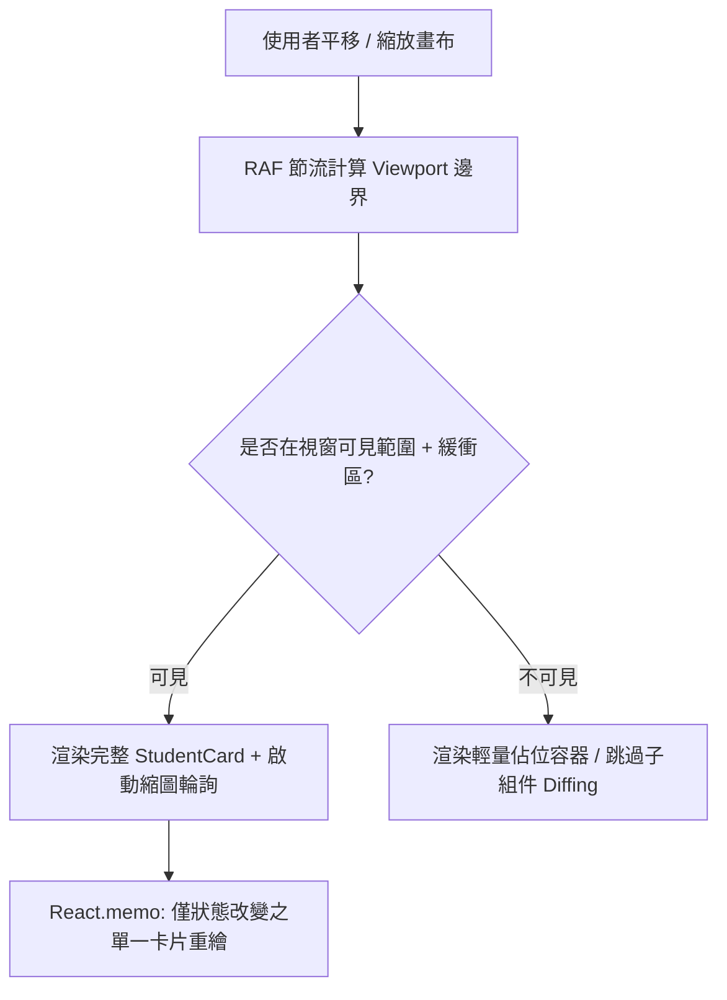

# 🚀 GridSight 前端畫布 Viewport Culling 與渲染效能改進計畫

本文檔詳細分析 GridSight 教師端控制台（`gs-console`）在面對 70~100 台大型電腦教室時之前端渲染架構、現存效能瓶頸，並制定具體的 **DOM Viewport Culling 虛擬化**、**組件記憶化 (`React.memo`)** 與 **平移/縮放節流優化計畫**。

---

## 📌 1. 現狀架構與效能瓶頸分析 (Current Bottlenecks)

目前 GridSight 控制台畫布（[`GridCanvas.tsx`](../../console/src/components/Canvas/GridCanvas.tsx)）已實作視窗可見性計算（`calculateVisibleSeats`），但該機制**僅作用於網路層的縮圖輪詢過濾**，在 DOM 渲染層與組件生命週期上仍存在以下三大瓶頸：

### 1.1 DOM 樹未實施視窗虛擬化 (Missing DOM-Level Culling)
- **現象**：不論教師將畫布放大至 250%（畫面僅顯示 4~6 個座位）或平移至角落，**全班 70+ 個 `StudentCard` 與上百個空白網格 (`totalRows × totalCols`) 依然全部掛載於 DOM 樹**。
- **後果**：
  - 每個卡片包含標題列、縮圖容器、狀態指示燈、遙測徽章與多個操作按鈕，單一卡片約產生 25~35 個 DOM 節點。
  - 70 台規模下 DOM 節點數高達 **2,500+ 個**。
  - 當使用者拖曳平移（Pan）或縮放（Zoom）時，瀏覽器 GPU / Layout 引擎仍須對所有可見與不可見元素進行幾何轉換與重繪。

### 1.2 缺乏組件級記憶化 (`React.memo`) 導致雪崩重繪 (Cascading Re-renders)
- **現象**：[`StudentCard.tsx`](../../console/src/components/Canvas/StudentCard.tsx) 與 [`ObstacleMarker.tsx`](../../console/src/components/Canvas/ObstacleMarker.tsx) 為標準 Functional Component，未以 `React.memo` 封裝。
- **後果**：
  - 輪詢管理器（`pollingManager.ts`）每秒更新「單一學生機」的縮圖或延遲時，`layout.seats` 陣列參考產生變更。
  - 觸發 `GridCanvas` 重新渲染，導致**全班 70 個卡片全部觸發 React Re-render**。
  - 每秒產生 70 次無效的虛擬 DOM Diffing，造成 CPU 週期浪費。

### 1.3 平移過程高頻計算未節流 (Unthrottled Pan Calculations)
- **現象**：`calculateVisibleSeats` 依賴 `pan` 與 `zoom` 狀態，在 `mousemove` 平移期間每秒觸發 60~120 次。
- **後果**：每一幀都在建立 `new Set<string>()`、遍歷所有座位幾何投影並呼叫 `onVisibleSeatsChange`，在低配教師機上容易造成微卡頓（Jank）。

---

## 🎯 2. 改進目標與預期指標 (Optimization Goals)

| 評估指標 | 現行狀態 (Current) | 優化後目標 (Target) | 預期改善幅度 |
| :--- | :--- | :--- | :--- |
| **70 台滿載每秒 React 重繪次數** | 70+ 次 / 秒 (全卡片重繪) | **1~3 次 / 秒** (僅變更卡片) | 🔻 **減少 ~95%** |
| **放大 200% 活躍 DOM 節點數** | ~2,500+ 個節點 | **~300 個節點** | 🔻 **減少 ~88%** |
| **快速平移畫布幀率 (FPS)** | 35 ~ 45 FPS (舊機易掉幀) | **穩定 60 FPS (滿幀流暢)** | 🟢 **大幅滑順** |
| **主執行緒 CPU 佔用率** | 12% ~ 20% | **< 3% (常態微負載)** | 🟢 **節能低溫** |

---

## 🛠️ 3. 具體改造方案 (Implementation Plan)



### 任務 1：DOM-Level Viewport Culling（視窗外卡片虛擬化）
- **實作方式**：
  在 `GridCanvas.tsx` 中使用預留緩衝區（`margin = 150px`）判定卡片是否落在螢幕可見區域內：
  - **可見卡片**：掛載完整 `StudentCard` 組件與圖片。
  - **不可見卡片**：僅渲染維持寬高的絕對定位空白輕量 `div`（保留拖曳定位與座位號標記，但不掛載內部圖示、縮圖與複雜按鈕）。
- **影響範圍**：`console/src/components/Canvas/GridCanvas.tsx`。

### 任務 2：組件級記憶化 (`React.memo`) 與 Props 穩定化
- **實作方式**：
  將 `StudentCard` 封裝於 `React.memo`，並撰寫精準之自訂比較函數（Custom Comparator）：
  ```tsx
  export const StudentCard = React.memo(StudentCardComponent, (prev, next) => {
    return (
      prev.device.thumbnailUrl === next.device.thumbnailUrl &&
      prev.device.status === next.device.status &&
      prev.device.isOffTask === next.device.isOffTask &&
      prev.device.selected === next.device.selected &&
      prev.isEditMode === next.isEditMode &&
      prev.isDragging === next.isDragging &&
      prev.isDragOver === next.isDragOver &&
      prev.device.activeWindow === next.device.activeWindow
    );
  });
  ```
- **影響範圍**：`console/src/components/Canvas/StudentCard.tsx`、`ObstacleMarker.tsx`。

### 任務 3：平移與縮放計算節流 (RAF & Set Equality Guard)
- **實作方式**：
  1. 平移時將 `calculateVisibleSeats` 綁定至 `requestAnimationFrame`（RAF），避免在單幀內多次計算。
  2. 加入 `Set` 內容比對守衛（Set Equality Check）：只有在可見設備 ID 集合**真正發生變化**（有設備進出視窗）時，才呼叫 `onVisibleSeatsChange`。
- **影響範圍**：`console/src/components/Canvas/GridCanvas.tsx`。

### 任務 4：利用現代 CSS 原生渲染加速 (CSS Containment)
- **實作方式**：
  為卡片容器添加 CSS 屬性，指示瀏覽器核心（Blink）隔離子樹佈局與繪製：
  ```css
  contain: layout style paint;
  content-visibility: auto;
  contain-intrinsic-size: 190px 150px;
  ```
- **影響範圍**：`console/src/index.css` 或卡片外層樣式。

---

## 📅 4. 階段里程碑 (Milestones)

- **Phase 1: React.memo & 空白網格渲染優化**
  - 封裝 `StudentCard` 與 `ObstacleMarker` 為 `React.memo`。
  - 在非編輯模式（`MONITOR`）下跳過未佔用空白格的複雜事件綁定。
- **Phase 2: DOM 虛擬化與可見性節流**
  - 在 `GridCanvas` 實裝視窗外卡片輕量佔位切換。
  - 導入 RAF 與 Set 內容守衛。
- **Phase 3: 100 台壓力測試與基準驗收**
  - 使用 `mock_agents.py` 啟動 100 台虛擬學生端，以 Chrome DevTools Performance 錄製 60 FPS 平移幀率與 CPU 佔用驗證。
